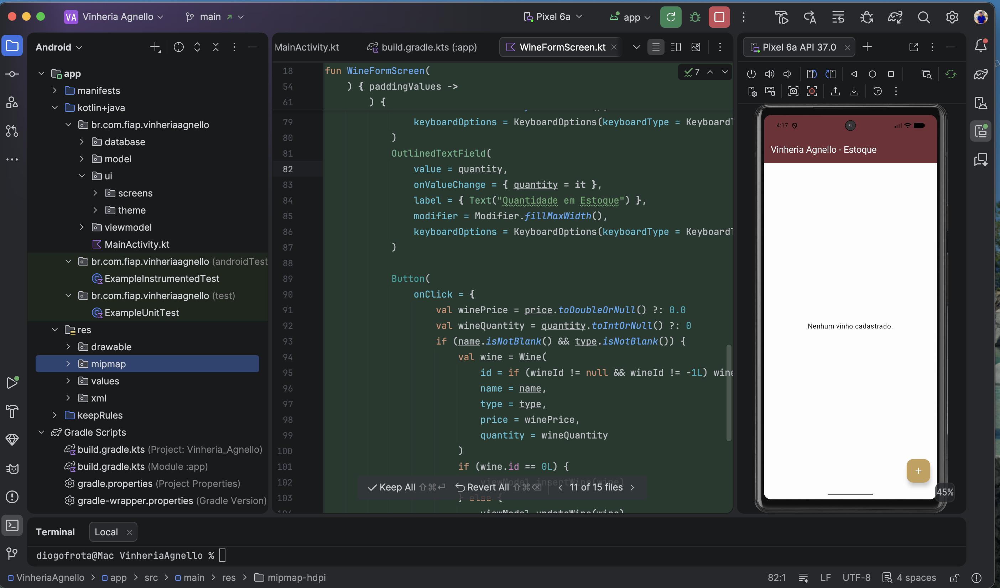
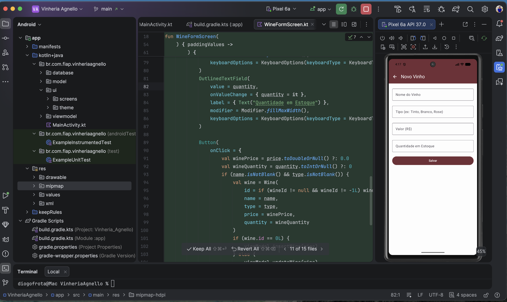
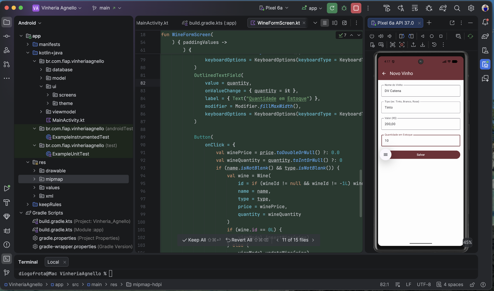
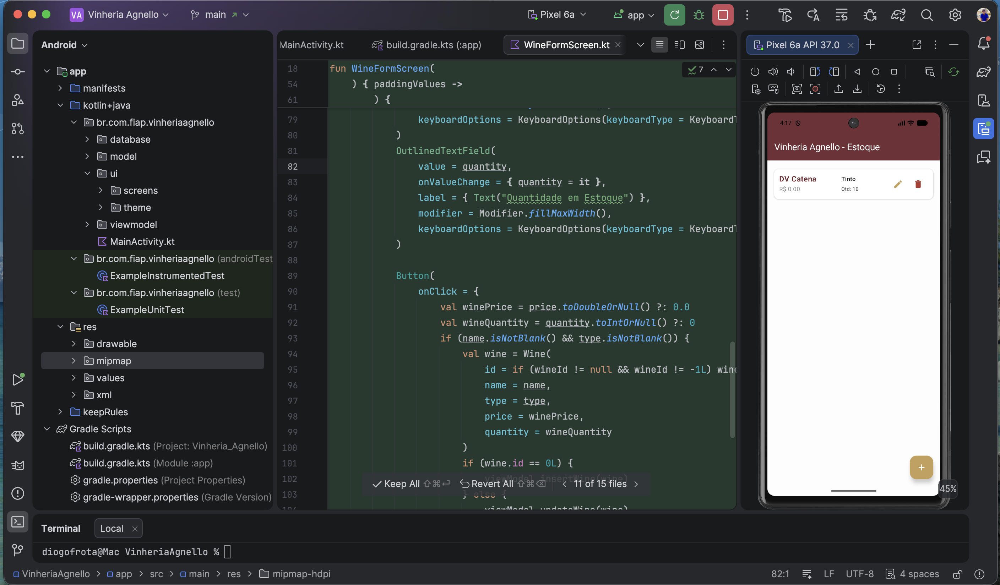

# Vinheria Agnello - Gerenciamento de Estoque 🍷

Aplicativo Android desenvolvido para o gerenciamento de estoque da Vinheria Agnello. O sistema permite o cadastro, edição, visualização e exclusão de vinhos, garantindo um controle eficiente de produtos, tipos, preços e quantidades.

## 🚀 Funcionalidades

- **Listagem de Estoque**: Visualização clara de todos os vinhos cadastrados em cartões informativos.
- **Cadastro de Vinhos**: Adição de novos produtos informando Nome, Tipo (Tinto, Branco, etc), Valor e Quantidade.
- **Edição**: Atualização de dados de vinhos existentes de forma rápida.
- **Exclusão**: Remoção de itens do estoque com confirmação visual.
- **Persistência Local**: Uso do banco de dados Room para manter os dados seguros mesmo após fechar o app.

## 🛠️ Tecnologias Utilizadas

- **Linguagem**: [Kotlin](https://kotlinlang.org/)
- **UI**: [Jetpack Compose](https://developer.android.com/jetpack/compose) (Material 3)
- **Arquitetura**: MVVM (Model-View-ViewModel) + Repository Pattern
- **Banco de Dados**: [Room Database](https://developer.android.com/training/data-storage/room)
- **Navegação**: [Compose Navigation](https://developer.android.com/jetpack/compose/navigation)
- **Processamento de Anotações**: KSP (Kotlin Symbol Processing)

## 🎨 UI/UX

O aplicativo foi desenhado com uma paleta de cores sofisticada inspirada no universo dos vinhos:
- **Bordô (WineRed)**: Cor principal para barras de ferramentas e botões.
- **Dourado (WineGold)**: Cor de destaque para ações principais.
- **Bege/Off-White**: Fundo suave para melhor leitura.

## 📸 Screenshots

Aqui estão as telas principais do sistema funcionando:

### 1. Lista de Estoque (Vazia)
A tela inicial mostra o estado atual do estoque. Quando não há vinhos cadastrados, uma mensagem informativa é exibida ao usuário.


---

### 2. Cadastro de Novo Vinho
Interface intuitiva para inserir os dados do produto, com campos validados e teclado numérico automático para valores e quantidades.


---

### 3. Formulário Preenchido (Edição/Cadastro)
Exemplo de inserção de dados. O sistema suporta nomes completos, tipos de uva e valores decimais.


---

### 4. Gestão de Estoque (Lista com Dados)
Visualização em cartões (Cards) com ícones coloridos para edição (Lápis) e exclusão (Lixeira), facilitando a gestão rápida do estoque.


## 🎥 Demonstração

*(Espaço reservado para o vídeo de demonstração do funcionamento do app)*

## 🏗️ Como rodar o projeto

1. Clone o repositório:
   ```bash
   git clone https://github.com/diogofrota/vinheria_agnello_android_app.git
   ```
2. Abra o projeto no **Android Studio** (versão Ladybug ou superior).
3. Certifique-se de usar o **JDK 17**.
4. Sincronize o Gradle e execute o app em um emulador ou dispositivo físico.

---
Desenvolvido como parte do projeto de gerenciamento de estoque para a FIAP.
